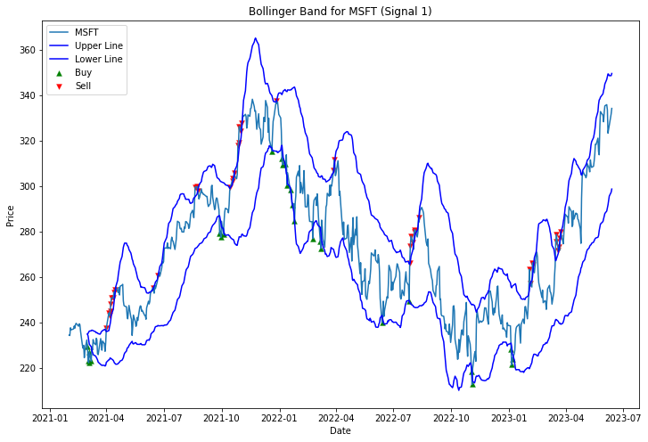

# Computational-Finance 📈 
2023 여름학기 튀빙겐대학교 석사수업 Computational Finance 기말 과제 프레젠테이션, A(2.0) 학점, 
세 개의 투자 알고리즘(이동평균, 볼린져 밴드, RSI)을 구현하여서 2010-01-01 과 2023-06-14 사이의 투자 수익률을 비교

## Research Notebook_Group 6

Name: Quanzeyu Yang &nbsp;&nbsp; StudentID: 5980972\
Name: Ranran Zhang  &nbsp;&nbsp; StudentID: 5987971\
Name: Xinru Yu&nbsp;&nbsp;       StudentID: 5997073\
Name: Marco Waibel&nbsp;&nbsp;   StudentID: 6295680\
Name: DongKeon Kim&nbsp;&nbsp;            StudentID: 6328874

## Download Data


```python
# DOWNLOAD DATA

# only change the equity ticker strings if required
# don't change the variable name "tickers"
tickers = [ \
    'AAPL', # Apple
    'MSFT', # Microsoft
    'AMZN', # Amazon
    '^GSPC'] # S&P500 - Benchmark

# only change string values if required
# don't change the two variable names "start_date" and "end_date"
start_date = '2010-01-01'
end_date = '2023-06-14'

# download the time series of adj. close price
# for each of the tickers from Yahoo finance
# in case you receive an error go through this:
## https://stackoverflow.com/questions/74832296/typeerror-string-indices-must-be-integers-when-getting-data-of-a-stock-from-y
price_data = {}

for ticker in tickers:
    price_data[ticker] = yf.download(ticker, start=start_date, end=end_date)['Adj Close']

# create dataframe with one row per day and adj. close price for each of the tickers
# and dataframe with price changes
df_prices = pd.concat([price_data[ticker].rename(ticker) for ticker in tickers], axis=1)
prev = df_prices.to_numpy()
prev = prev / np.insert(prev[:-1,:], 0, np.ones(prev.shape[1]), 0)
prev[0] = np.ones(prev.shape[1])
df_price_changes = df_prices.copy(deep=True)
df_price_changes[:] = prev

# print dataframes
print(df_prices)
print(df_price_changes)
```

    [*********************100%***********************]  1 of 1 completed
    [*********************100%***********************]  1 of 1 completed
    [*********************100%***********************]  1 of 1 completed
    [*********************100%***********************]  1 of 1 completed
                      AAPL        MSFT        AMZN        ^GSPC
    Date                                                       
    2010-01-04    6.496294   23.572361    6.695000  1132.989990
    2010-01-05    6.507526   23.579981    6.734500  1136.520020
    2010-01-06    6.404015   23.435274    6.612500  1137.140015
    2010-01-07    6.392177   23.191557    6.500000  1141.689941
    2010-01-08    6.434675   23.351492    6.676000  1144.979980
    ...                ...         ...         ...          ...
    2023-06-07  177.820007  323.380005  121.230003  4267.520020
    2023-06-08  180.570007  325.260010  124.250000  4293.930176
    2023-06-09  180.960007  326.790009  123.430000  4298.859863
    2023-06-12  183.789993  331.850006  126.570000  4338.930176
    2023-06-13  183.309998  334.290009  126.660004  4369.009766
    
    [3384 rows x 4 columns]
                    AAPL      MSFT      AMZN     ^GSPC
    Date                                              
    2010-01-04  1.000000  1.000000  1.000000  1.000000
    2010-01-05  1.001729  1.000323  1.005900  1.003116
    2010-01-06  0.984094  0.993863  0.981884  1.000546
    2010-01-07  0.998152  0.989600  0.982987  1.004001
    2010-01-08  1.006648  1.006896  1.027077  1.002882
    ...              ...       ...       ...       ...
    2023-06-07  0.992244  0.969132  0.957507  0.996188
    2023-06-08  1.015465  1.005814  1.024911  1.006189
    2023-06-09  1.002160  1.004704  0.993400  1.001148
    2023-06-12  1.015639  1.015484  1.025440  1.009321
    2023-06-13  0.997388  1.007353  1.000711  1.006932
    
    [3384 rows x 4 columns]


## Define the Moving Average Function


```python
# define the Moving average crossover 
def moving_avg_crossover(prices, window_length):
# set the size of moving average series
    T = len(prices)
    moving_avg = np.zeros(T)  
    moving_avg[:] = np.nan 
# calculate the average by moving time period
    for n in range(window_length, T):
      moving_avg[n] = np.sum(prices[n-window_length:n]) / window_length
    return moving_avg 
```

## Define the Standard Deviation


```python
# calculate the standard deviation of moving average for Bollinger bands
def standard_deviation(prices, moving_avg_crossover):
    std= (((prices - moving_avg_crossover)**2)**0.5)
    return std
```

## Define other necessary Functions


```python
# calculate the mean
def cal_mean(inputs):
    return np.sum(inputs) / len(inputs) 

# calculate standard deviation
def cal_std(inputs):
    return np.sqrt(np.sum(np.square(inputs - cal_mean(inputs))) / len(inputs))

# calculate log returns
def log_return(inputs):
    return np.log(inputs).diff() 

def calculate_excess_average(df):
    """
    Calculate the average daily return in excess of a risk-free rate
    """
    return df.mean()

def calculate_std_dev(df):
    """
    Calculate the standard deviation of daily returns using the formula you provided
    """
    avg = df.mean()
    var = sum(pow(x-avg,2) for x in df) / len(df)
    return np.sqrt(var)

def calculate_sharpe_ratio(df):
    """
    Calculate the Sharpe ratio for each strategy
    """
    # Calculate average excess return
    excess_average = calculate_excess_average(df)

    # Calculate standard deviation
    std_dev = df.apply(calculate_std_dev, axis=0)

    # Calculate Sharpe ratio
    sharpe_ratio = excess_average / std_dev

    return sharpe_ratio
```

## 1. Signal 0: Moving Average Crossover

Related Literature: Appel, Gerald (2005). Technical Analysis Power Tools for Active Investors. Financial Times Prentice Hall. p. 166. ISBN 0-13-147902-4.
Moving Average Crossover is used to identify the potential signals to buy or sell. In the calculation, it usually uses two different window periods, normally one short time and one long time. And then make a comparison between the moving average of each time period.
When a shorter-term moving average crosses a longer-term moving average from below, which is seen as a buy signal. Conversely, when a shorter-term moving average crosses a longer-term moving average from above, which is seen as a sell signal.
It is active when the following condition is met in 𝑡t if the short period line is large than the long period line means that

$\frac{1}{20}\sum\limits^{19}_{i=0}p_{t-i}>\frac{1}{100}\sum\limits^{99}_{i=0}p_{t-i}$

The Moving Average Crossover serves as a simple yet powerful tool for trend-following and momentum strategies. One significant advantage of this technique is its simplicity. This clarity can facilitate prompt investment decisions and allows for easy implementation in algorithmic trading systems. Moreover, it provides clear signals for entry and exit points, reducing emotional biases in trading decisions. However, it's not without its challenges. One significant drawback is the potential for false signals, often resulting from volatile price fluctuations. This susceptibility can lead to poor trades if not managed correctly. Furthermore, the Moving Average Crossover relies on past data. This aspect can result in delayed entry or exit signals. It is also not effective across all market conditions. While it can perform well in trending markets, its effectiveness can be worse in range-bound or sideways markets. In summary, the Moving Average Crossover provides clear and easy signals, making it an attractive tool for various traders. It's better to use this tool alongside other indicators to confirm signals and improve decision-making in trading strategies.


```python
### SIGNAL 0

def signal_0(series):
    # Init
    signals = pd.DataFrame(index = series.index) 
    signals['signal'] = 0.0 
    
    # Compute simple moving average for short-term and long-term
    short_window = 20
    long_window = 100
    signals['short_ma'] = moving_avg_crossover(series, short_window)
    signals['long_ma'] = moving_avg_crossover(series, long_window)

    # Compute signals: buys and sells
    signals['buy']= np.where(signals['short_ma']> signals['long_ma'], 1.0, 0.0)  
    signals['sell'] = np.where(signals['short_ma']< signals['long_ma'], -1.0, signals['signal'])

    # modify the real signals in order to do not generate sell signals when there were no buy signals before,
    # and in order to record the real buy, holding, sell signals
    # if previos signal is 0 and buy signal occurs in the current, buy the stock
    signals['signal'] = np.where((signals['signal'].shift(1) == 0) & (signals['buy'] == 1), 1, signals['signal'])
    # if previos signal is 0 and sell signal occurs in the current, do not sell the stock
    signals['signal'] = np.where((signals['signal'].shift(1) == 0) & (signals['sell'] ==-1), 0,signals['signal'] )
    # if previos signal is buy and sell signal occurs in the current, sell the stock
    signals['signal'] = np.where((signals['signal'].shift(1) == 1) & (signals['sell'] == -1), -1, signals['signal'])
    # if previos signal is 0 and buy signal occurs in the current, buy the stock
    signals['signal'] = np.where((signals['signal'].shift(1) == 1) & (signals['buy'] == 1), 1, signals['signal'])
    # if previos signal is sell and sell signal occurs in the current, return zero, do not sell when there were no buy signal before
    signals['signal'] = np.where((signals['signal'].shift(1) == -1) & (signals['sell'] == -1), 0, signals['signal'])
    # if previos signal is sell and buy signal occurs in the current, buy the stock
    signals['signal'] = np.where((signals['signal'].shift(1) == -1) & (signals['buy'] == 1), 1, signals['signal'])
    
    # compute the position_change in order to deliver it to portflio allocation
    signals['position_change'] = signals['signal'].diff()
    signals.loc[series.index[0], 'position_change'] = 0
    return signals
```

## 2. Signal 1: Bollinger Bands 

Related Literature: John Bollinger, Published in Stocks & Commodities V. 10:2 (47-51),1992.\
Bollinger Bands aim to give investors a higher probability of identifying whether an asset is oversold or overbought.\
There are three lines in Bollinger Bands: a simple moving average, and an upper and lower lines.\
It is calculated from the standard error and its intervals. Based on this it determines the range of price fluctuations and stock prices' future trends.\
There are three lines in this index's chart, the upper line, the lower line, and the middle line.\
We can calculate the upper and lower line following the equations below.\
\
$Mid-line: \frac{1}{20}\sum\limits^{19}_{i=0}p_{t-i}$
\
$Buy-Signal: p_{t-i}<(\frac{1}{20}\sum\limits^{19}_{i=0}p_{t-i} - 2*\frac{1}{20}\sum\limits^{19}_{i=0}\sigma_{t-i})$
\
$Sell-Signal: p_{t-i}>(\frac{1}{20}\sum\limits^{19}_{i=0}p_{t-i} + 2*\frac{1}{20}\sum\limits^{19}_{i=0}\sigma_{t-i})$
\
The upper and lower bounds of the Bollinger Bands are not fixed and vary with the rolling of the stock price.
The width of this band-shaped range, within which the stock price fluctuates between upper and lower limits, varies depending on the magnitude of the price movements. When the stock price has larger fluctuations, the band becomes wider. Conversely, when the price fluctuations are smaller and the market is consolidating, the band will narrow.
Bollinger Bands serve as a highly useful tool in the world of investing. A critical advantage of Bollinger Bands is their ability to adapt dynamically to price volatility, expanding during periods of high volatility and contracting during calmer market environments. This feature makes them particularly useful for identifying periods of potential price extremes and subsequent reversals. Furthermore, by providing a visual depiction of an asset's price volatility and its relative high and low, Bollinger Bands contribute to a more comprehensive analysis of market trends and price levels.
Nevertheless, Bollinger Bands are not without limitations. One of the main drawbacks is that they can sometimes produce false signals, particularly in highly volatile markets. These signals could potentially lead an investor to make wrong or unfavorable trading decisions. Moreover, while Bollinger Bands can indicate overbought or oversold conditions, they cannot provide specific timing signals, thus the necessity to use them in conjunction with other indicators. 


```python
def signal_1(series):
    # Initial Dataframe
    signals = pd.DataFrame(index = series.index) 
    signals['signal'] = 0.0 
    # calculate the middle line: moving average
    mid_window=20
    signals['mid_line'] = moving_avg_crossover(series, mid_window)
    # calculate the moving standard deviation
    signals['std'] = standard_deviation(series, signals['mid_line'])
    signals['moving_avg_std'] = moving_avg_crossover(signals['std'], mid_window)
    # calculate the upper band
    signals['upper_line'] = moving_avg_crossover(series, mid_window)+(2*signals['moving_avg_std'])
    # calculate the lower band
    signals['lower_line'] = moving_avg_crossover(series, mid_window)-(2*signals['moving_avg_std'])
    
    # Compute signals: buys and sells
    signals['buy'] = np.where(series < signals['lower_line'] , 1.0, 0.0)   
    signals['sell'] = np.where(series > signals['upper_line'], - 1.0, signals['signal'])
    
    # modify the real signals in order to do not generate sell signals when there were no buy signals before,
    # and in order to record the real buy, holding, sell signals
    # if previos signal is 0 and buy signal occurs in the current, buy the stock
    signals['signal'] = np.where((signals['signal'].shift(1) == 0) & (signals['buy'] == 1), 1, signals['signal'])
    # if previos signal is 0 and sell signal occurs in the current, do not sell the stock
    signals['signal'] = np.where((signals['signal'].shift(1) == 0) & (signals['sell'] ==-1), 0,signals['signal'] )
    # if previos signal is buy and sell signal occurs in the current, sell the stock
    signals['signal'] = np.where((signals['signal'].shift(1) == 1) & (signals['sell'] == -1), -1, signals['signal'])
    # if previos signal is 0 and buy signal occurs in the current, buy the stock
    signals['signal'] = np.where((signals['signal'].shift(1) == 1) & (signals['buy'] == 1), 1, signals['signal'])
    # if previos signal is sell and sell signal occurs in the current, return zero, do not sell when there were no buy signal before
    signals['signal'] = np.where((signals['signal'].shift(1) == -1) & (signals['sell'] == -1), 0, signals['signal'])
    # if previos signal is sell and buy signal occurs in the current, buy the stock
    signals['signal'] = np.where((signals['signal'].shift(1) == -1) & (signals['buy'] == 1), 1, signals['signal'])
    
    # compute the position_change in order to deliver it to portflio allocation
    signals['position_change'] = signals['signal'].diff()
    signals.loc[series.index[0], 'position_change'] = 0


    return signals
```

## 3. Signal 2: Relative Strength Index
Related Literature: New Concepts in Technical Trading Systems by J. Welles Wilder, ISBN 0-89459-027-8\
The relative strength index (RSI) is a popular momentum oscillator introduced in 1978.
RSI is to analyze the intention and strength of market trading orders, and then analyze the future trend of the market, by comparing the average closing increase and the average closing decline of stocks over a period of time. \
Normally RSI requires time periods -- lookback period, commonly 6,9,14 days, here we choose 14 days for the calculation.\
In order to calculate RSI, we need to first calculate RS. RS is calculated by average gain and average loss.\
\
$RS = \frac{Avg.Gain}{Avg.Loss}$\
\
After we get RS, we use it to calculate RSI\
\
$RSI = 100 - \frac{100}{1+RS}$\
\
Normally RSI requires time periods -- look-back period, commonly 6,9,14 days, here we choose 14 days for the calculation. \
Define the signal RSI: RSI is to analyze the intention and strength of market trading orders, and then analyze the future trend of the market, by comparing the average closing increase and the average closing decline of stocks over a period of time.\
RSI values are between 0 and 100. We judge the market condition by RSI values: 
When RSI values are between 30-70,  it places at a normal range. 
When the RSI value is> 70, it is overbought, suggesting a possible price pullback. 
When the RSI value < 30, it is oversold, meaning a possible price rebound.
The RSI possesses several advantages that make it an invaluable tool for traders. Its primary benefit lies in its ability to identify potential overbought and oversold conditions in the market. This feature can signal possible trend reversals, enabling traders to anticipate potential buying or selling opportunities. Additionally, RSI's mathematical nature ensures it provides an objective evaluation of the price momentum, adding to its credibility and utility.
However, the RSI is not without its limitations. Its major drawback is that during strongly trending markets, the RSI can remain in overbought or oversold territories for extended periods. This can lead to misleading signals, suggesting a reversal where none occurs. Therefore, relying solely on the RSI for trading decisions can potentially lead to losses. The RSI is also a lagging indicator, meaning it follows price movements and thus may not accurately predict future market trends.
This approach will provide a more comprehensive view of the market and help to mitigate potential risks.
What's more, it is important to note that RSI is a short-term indicator. In practical application, it should be used in conjunction with other indicators and analysis tools for better decision-making.


```python
# calculate for signal_2 RSI
def signal_2(series):
    signals = pd.DataFrame(index = series.index)
    signals['signal'] = 0.0
    # Set the window period as 14 days
    window_period = 14 
    signals['price']=series
    signals['prices_diff'] = series.diff()
    # calculate the gain and loss during the lookback period
    # for the gain history within the lookback period (0 if there is no gain, and the magnitude of gain if there is gain)
    signals['up'] = np.where(signals['prices_diff'] > 0, signals['prices_diff'], 0.0)
    # for the loss history within the lookback period (0 if there is no loss, and the magnitude of loss if there is loss)
    signals['down'] = np.where(signals['prices_diff'] < 0, np.abs(signals['prices_diff']), 0.0)
    # set the lookback period as 14 days, a half of 28 days also support the results
    signals['avg_up'] = moving_avg_crossover(signals['up'], window_period)
    signals['avg_down'] = moving_avg_crossover(signals['down'], window_period)

    # Compute signals
    # calculate RS, and then RSI
    signals['RS'] =  signals['avg_up'] / signals['avg_down']  
    signals['RSI'] = 100 - (100 / (1.0 + signals['RS']))
    # Generate signals
    
    signals['buy'] = np.where(signals['RSI'] < 30 , 1.0, 0.0)        
    # derive position change directly from signal 
    signals['sell'] = np.where(70 < signals['RSI'] , -1.0, signals['signal'])
    
    # modify the real signals in order to do not generate sell signals when there were no buy signals before,
    # and in order to record the real buy, holding, sell signals
    # if previos signal is 0 and buy signal occurs in the current, buy the stock
    signals['signal'] = np.where((signals['signal'].shift(1) == 0) & (signals['buy'] == 1), 1, signals['signal'])
    # if previos signal is 0 and sell signal occurs in the current, do not sell the stock
    signals['signal'] = np.where((signals['signal'].shift(1) == 0) & (signals['sell'] ==-1), 0,signals['signal'] )
    # if previos signal is buy and sell signal occurs in the current, sell the stock
    signals['signal'] = np.where((signals['signal'].shift(1) == 1) & (signals['sell'] == -1), -1, signals['signal'])
    # if previos signal is 0 and buy signal occurs in the current, buy the stock
    signals['signal'] = np.where((signals['signal'].shift(1) == 1) & (signals['buy'] == 1), 1, signals['signal'])
    # if previos signal is sell and sell signal occurs in the current, return zero, do not sell when there were no buy signal before
    signals['signal'] = np.where((signals['signal'].shift(1) == -1) & (signals['sell'] == -1), 0, signals['signal'])
    # if previos signal is sell and buy signal occurs in the current, buy the stock
    signals['signal'] = np.where((signals['signal'].shift(1) == -1) & (signals['buy'] == 1), 1, signals['signal'])
    
    # compute the position_change in order to deliver it to portflio allocation
    signals['position_change'] = signals['signal'].diff()
    signals.loc[series.index[0], 'position_change'] = 0
    return signals

```

## Compute 3 signals together


```python
# Compute signals
signals = {}
# Moving average crossover for AAPL
signals[tickers[0]] = signal_0(df_prices[tickers[0]])
# Bollinger band for MSFT
signals[tickers[1]] = signal_1(df_prices[tickers[1]])
# RSI for AMZN
signals[tickers[2]] = signal_2(df_prices[tickers[2]])
df_position_open = pd.concat([
    signals[tickers[0]]['signal'].rename(tickers[0]),
    signals[tickers[1]]['signal'].rename(tickers[1]),
    signals[tickers[2]]['signal'].rename(tickers[2])], axis = 1)
df_position_changes = pd.concat([
    signals[tickers[0]]['position_change'].rename(tickers[0]),
    signals[tickers[1]]['position_change'].rename(tickers[1]),
    signals[tickers[2]]['position_change'].rename(tickers[2])], axis = 1)
```

## Portfolio Allocation


```python
# ALLOCATE CAPITAL AND COMPUTE RESULTING POSITIONS
initial_cash = 1.0
capital_fraction_per_trade = 0.05

# DO NOT MODIFY THIS CELL BELOW THIS LINE
position = []

def open_trades(position, position_change):
    vec = np.maximum([position_change[ticker] for ticker in tickers[:-1]], [0])
    vec = position[-1] * (1 - np.power((1 - capital_fraction_per_trade), np.sum(vec))) * vec / (1 if (np.nansum(vec) == 0.0) else np.nansum(vec))
    return np.append(vec + position[:-1], position[-1] - np.sum(vec))

def hold_trades(position, price_change):
    return np.concatenate((position[:-1] * price_change[:-1], [position[-1]]))

def close_trades(position, position_change):
    vec = np.concatenate((np.array([position_change[ticker] < 0.0 for ticker in tickers[:-1]]), [False]))
    position[-1] = position[-1] + np.sum(position[vec])
    position[vec] = 0.0
    return position
    
is_first = True
for idx, position_change in df_position_changes.iterrows():
    if is_first:
        position.append(open_trades(np.concatenate((np.zeros(len(df_position_changes.columns)), [initial_cash])), position_change))
        is_first = False
    else:
        hlpr_pos = hold_trades(position[-1], df_price_changes.loc[[idx]].to_numpy()[0])
        hlpr_pos = close_trades(hlpr_pos, position_change)
        position.append(open_trades(hlpr_pos, position_change))

df_position = pd.DataFrame(position, index = df_prices.index, columns = tickers[:-1] + ['cash'])
```

## Statistics Part


```python
# COMPUTE MEANINGFUL STATISTICS OF YOUR STRATEGY
# YOU ARE FREE TO CHOOSE MEASURES

# REMEMBER THAT YOU MAY NOT USE READY-TO-USE FUNCTIONS
# WHEN IN DOUBT - CODE A FUNCTION ON YOUR OWN!
# EXAMPLE: .mean() and .std() are ready-to-use, that's why they are implemented below

returns = df_position.sum(axis=1)
returns = (returns[1:].to_numpy() / returns[:-1].to_numpy()) - 1
mean_returns = np.sum(returns) / len(returns)
std_returns = np.sqrt(np.sum(np.square(returns - mean_returns)) / len(returns))
print('Annualized mean: ' + str(mean_returns * 250))
print('Annualized std:  ' + str(std_returns * np.sqrt(250)))


```

    Annualized mean: 0.02986025196416671
    Annualized std:  0.03220002530553832


## Plotting

### 1.Singnal 0: Moving Average


```python
# Select the APPL ticker for signal 0
appl_prices = df_prices['AAPL']
signals = signal_0(appl_prices)

# plotting
plt.figure(figsize=(20, 12))
signals['short_ma'].plot(color='blue', lw=1, label='short_ma')
signals['long_ma'].plot(color='green', lw=1, label='long_ma')
appl_prices.plot(color='black', lw=1, label='AAPL')

# Plot 'buy' signals
buy_signals = signals[signals['signal'].diff() == 1]
plt.plot(buy_signals.index.tolist(), buy_signals['short_ma'].to_numpy(), '^', markersize=15, color='g', label='Buy')

# Plot 'sell' signals
sell_signals = signals[signals['signal'] == -1]
plt.plot(sell_signals.index.tolist(), sell_signals['long_ma'].to_numpy(), 'v', markersize=15, color='r', label='Sell')

plt.ylabel('Price', fontsize=15)
plt.xlabel('Date', fontsize=15)
plt.title('Moving Average for AAPL (Signal 0)', fontsize = 20)
plt.legend()
plt.grid()

plt.show()
```


    

    


### 2.Singnal 1: Bollinger Bands


```python
# Select the MSFT ticker for Signal 1
msft_prices = df_prices['MSFT'].loc['2021-02-01':]

# Compute Signal 1 for MSFT
signals = signal_1(msft_prices)

# Plotting
fig, ax = plt.subplots(figsize=(12, 8))

# Plot the series
ax.plot(msft_prices.index, msft_prices, label='MSFT')

# Plot the upper and lower lines
ax.plot(signals.index, signals['upper_line'], label='Upper Line', color='b')
ax.plot(signals.index, signals['lower_line'], label='Lower Line', color='b')

# Plot the buy signals
buy_signals = signals[signals['buy'] == 1]
ax.scatter(buy_signals.index, msft_prices.loc[buy_signals.index], color='g', marker='^', label='Buy', linewidth=0.3)

# Plot the sell signals
sell_signals = signals[signals['sell'] == -1]
ax.scatter(sell_signals.index, msft_prices.loc[sell_signals.index], color='r', marker='v', label='Sell', linewidth=0.3)

ax.set_xlabel('Date')
ax.set_ylabel('Price')
ax.set_title('Bollinger Band for MSFT (Signal 1)')
ax.legend()

plt.show()
```


    

    


### 3. Signal 2: RSI


```python
# Calculate the signals
amzn_signals = signal_2(df_prices['AMZN'])

# Start for the graphs 
amzn_signals = amzn_signals.loc['2021-01-01':]

# Create 2 graphs (Stock and RSI)
fig, ax = plt.subplots(2, 1, figsize=(10,8))

# Showing stock prices
ax[0].plot(amzn_signals.index, amzn_signals['price'], label='Price')
ax[0].set_title('AMZN Stock')
ax[0].grid()

# Parameter for buy and sell signal
prev_rsi = amzn_signals['RSI'].shift(1)
buy = (amzn_signals['RSI'] < 30) & (prev_rsi >= 30)
sell = (amzn_signals['RSI'] > 70) & (prev_rsi <= 70)

# Showing RSI on second graph
ax[1].plot(amzn_signals.index, amzn_signals['RSI'], label='RSI', color='blue')

# Red marker for sell 
ax[1].scatter(amzn_signals[sell].index, amzn_signals[sell]['RSI'], color='red', label='Sell signal')

# Green marker for buy
ax[1].scatter(amzn_signals[buy].index, amzn_signals[buy]['RSI'], color='green', label='Buy signal')

# Create barrier (30 and 70)
ax[1].axhline(30, color='darkgreen', linestyle='--')
ax[1].axhline(70, color='darkred', linestyle='--')

ax[1].set_title('RSI & Trading signals for AMZN')
ax[1].grid()

ax[1].legend(loc='upper left')

# Output
plt.tight_layout()
plt.show()

```


    

    


## Portfolio


```python
# COMPUTE MEANINGFUL PLOTS OF YOUR STRATEGY AND LABEL IT IN AN UNDERSTANDABLE WAY
df_position.sum(axis=1).plot(figsize=(20,12))
plt.title("Overall Performance of the Trading Portfolio",fontsize= 18)
plt.xlabel("Date", fontsize = 14)
plt.xticks(fontsize=14)
plt.ylabel("Return", fontsize = 14)
plt.yticks(fontsize=14)
plt.show()
```


    

    


```python
# Plotting the portfolio return against S&P 500 Index and the single stock returns (based on the first day in the data set)

# Take the stock prices and divide them by the first element in the time frame to get the percentage return
df_position.sum(axis=1).plot(label= 'Trading portfolio', linestyle= 'solid', figsize = (20, 12))
(df_prices['^GSPC']/(df_prices['^GSPC'][0])).plot(label= 'S&P 500 Benchmark', linestyle= 'solid')
(df_prices[tickers[0]]/(df_prices[tickers[0]][0])).plot(label= tickers[0], linestyle= 'solid')
(df_prices[tickers[1]]/(df_prices[tickers[1]][0])).plot(label= tickers[1], linestyle = 'solid')
(df_prices[tickers[2]]/(df_prices[tickers[2]][0])).plot(label= tickers[2], linestyle = 'solid')
plt.legend()
```


    <matplotlib.legend.Legend at 0x22045080b50>


    

    


## Performance Measurement - Sharpe Ratio 

The Sharpe ratio is widely used in finance, which helps to evaluate the risk-adjusted performance of an investment or trading strategy. It was developed by Nobel laureate William F. Sharpe.
The Sharpe ratio calculates the excess return of an investment (or strategy) per unit of its risk. It provides a way to compare different investments or strategies by considering both their returns and their risk levels.

The formula for the Sharpe ratio is as follows:

$Sharp Ratio = \frac{R_p - R_f}{\sigma_p}$

$R_p$ is the average return of the investment or strategy.
$R_f$ is the risk-free rate of return (typically a government bond rate), representing the return of a risk-free investment.
$\sigma_p$ is the standard deviation of the investment or strategy's returns, which measures its volatility, namely the risk.
The Sharpe ratio essentially measures the additional return generated per unit of risk taken. A higher Sharpe ratio indicates better risk-adjusted performance, as it represents the investment or strategy is more likely to generate higher returns related to its risk.


```python
#caculate the annual standard deviation
def calculate_annual_std(df, trading_days=252):
    std_data = {}
    for column in df:
        mean = df[column].mean()
        diff_squared = [(x - mean) ** 2 for x in df[column]]
        variance = sum(diff_squared) / len(df[column])
        std_dev = (variance ** 0.5) * (trading_days ** 0.5)  # annualizing std
        std_data[column] = std_dev
    return std_data

annual_std_dev = calculate_annual_std(df_price_changes)
print(annual_std_dev)
```

    {'AAPL': 0.2851526939601378, 'MSFT': 0.26084014049708004, 'AMZN': 0.3314306101824793, '^GSPC': 0.17712612396160154}


```python
# download 5-year US treasury yield as the risk-free rate
risk_free_rate = yf.download('^FVX', start=start_date, end=end_date)['Adj Close'] 
# convert to daily returns
risk_free_rate = log_return(risk_free_rate)#risk_free_rate.pct_change() + 1 
# annualize the risk-free rate
annual_rf_rate = cal_mean(risk_free_rate)**250 - 1
print (risk_free_rate)

```

    [*********************100%***********************]  1 of 1 completed
    Date
    2010-01-04         NaN
    2010-01-05   -0.036088
    2010-01-06    0.005847
    2010-01-07    0.010439
    2010-01-08   -0.013163
                    ...   
    2023-06-07    0.016206
    2023-06-08   -0.016206
    2023-06-09    0.016461
    2023-06-12   -0.000766
    2023-06-13    0.026205
    Name: Adj Close, Length: 3381, dtype: float64


```python
df_sharpe= df_position.resample('Y').mean()
df_sharpe['sum']= df_sharpe.sum(axis=1)
df_sharpe['return']=df_sharpe['sum']/df_sharpe['sum'].shift() -1

# adding the annual risk free rate
df_sharpe = pd.merge(df_sharpe, risk_free_rate, left_on= df_sharpe.index, right_on = risk_free_rate.index)
df_sharpe.set_index ('key_0', inplace = True)

# creating data frame
df_position_sharpe = df_position.copy()
df_position_sharpe['sum']= df_position_sharpe.sum(axis=1)

# adding the year collumn
df_position_sharpe['year']=df_position_sharpe.index.year
df_sharpe['year']=df_sharpe.index.year

# copy index 
df_position_sharpe['index']=df_position_sharpe.index

# Merge sharpe
df_position_sharpe = pd.merge(df_position_sharpe, df_sharpe[['year', 'sum']], on ='year', how = 'left' )
# Resetting index
df_position_sharpe.set_index('index', inplace= True)

# calculating the std dev.
df_position_sharpe['std']= standard_deviation(df_position_sharpe['sum_x'], df_position_sharpe['sum_y'])

# Resampeling
df_sharpe['std']=df_position_sharpe['std'].resample('Y').mean()

# calculating the sharp ratio
df_sharpe['Sharpe_ratio']= (df_sharpe['return']- (df_sharpe['Adj Close']/100))/df_sharpe['std']

# renaming the columns
df_sharpe = df_sharpe.rename (columns = {"sum": "portfolio_value", 'return': 'return_per_year', 'Adj Close': 'risk_free_rate%'})

Sharpe_ratio = cal_mean(df_sharpe)

print(Sharpe_ratio)
```

    AAPL                  0.120882
    MSFT                  0.001989
    AMZN                  0.003334
    cash                  1.074138
    portfolio_value       1.200344
    return_per_year       0.034448
    risk_free_rate%      -0.009617
    year               2015.777778
    std                   0.014162
    Sharpe_ratio          2.752230
    dtype: float64

